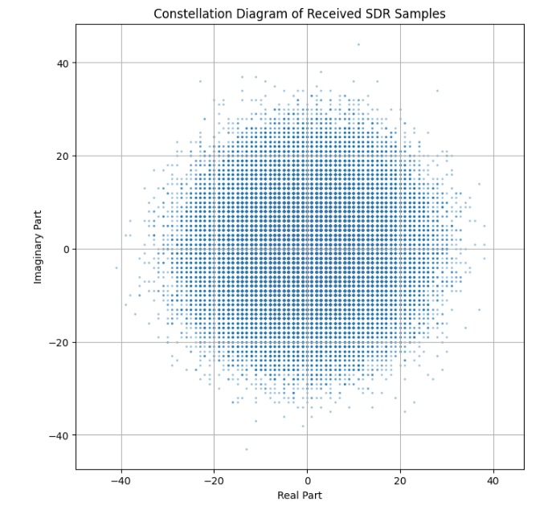
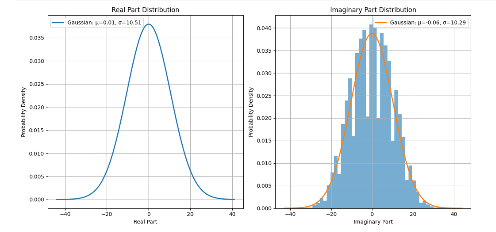
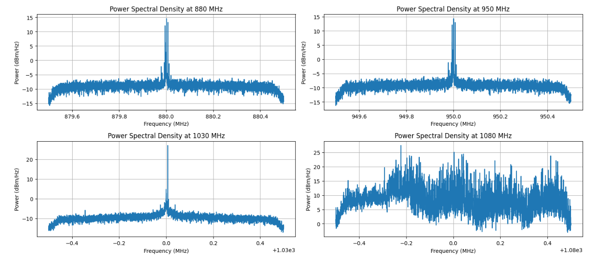

# 📡 SDR Lab: Noise Analysis & FM Reception

<p align="center">
  
</p>

<p align="center">
  <b>Software-Defined Radio • DSP • Noise Analysis • FM Demodulation</b>
</p>

<p align="center">


</p>

## 📌 Overview

This notebook is designed as an introductory practical lab for Software-Defined Radio and signal processing.

The project works with an **ADALM-Pluto (PlutoSDR)** and uses Python to explore:

- Complex signal representation
- Noise characteristics and noise-floor analysis
- Time-domain and frequency-domain signal representations
- FM radio reception
- FM demodulation
- Audio resampling and playback
- Real-time FM signal processing

The lab is divided into two main parts:

```text
Part 1 → Receiving and Analyzing Noise
Part 2 → FM Radio Reception and Demodulation
```

---

## ✨ Key Features

- 📡 PlutoSDR signal acquisition
- 🔢 Complex I/Q sample analysis
- 📊 Constellation/scatter-plot visualization
- 📈 Time-domain signal analysis
- 📉 Power spectral density (PSD) analysis
- 🔊 Noise-floor measurement
- 📻 FM radio signal reception
- 🎚️ FM demodulation
- 🔄 Signal resampling
- 🔊 Audio playback
- ⚡ Real-time FM demodulation

---

## 🧰 Technologies Used

### Hardware

- **ADALM-Pluto (PlutoSDR)**

### Programming Language

- **Python**

### Python Libraries

- NumPy
- SciPy
- Matplotlib
- SoundDevice
- Analog Devices `adi` library

### Platform

- Jupyter Notebook / Python environment

---

## ⚙️ SDR Configuration

The notebook configures PlutoSDR using the following main parameters:

| Parameter | Value |
|-----------|-------:|
| Sample Rate | 1 MHz |
| Samples per RX call | 100,000 |
| RX Gain | 70 dB |
| Gain Control | Manual |
| RF Bandwidth | 1 MHz |
| PlutoSDR IP | `192.168.2.1` |

The PlutoSDR is configured through the `adi` Python library.

> **Note:** The PlutoSDR IP address may need to be changed according to the network/USB configuration of the connected device.

---

# 📊 Part 1: Receiving and Analyzing Noise

The first part of the lab focuses on understanding the raw complex samples received from the SDR.

## 1. Receiving Complex Samples

The notebook receives samples using:

```python
samples = sdr.rx()
```

The received samples are complex-valued I/Q samples containing real and imaginary components.

An example output shows:

```text
Received 100000 samples
Sample data type: complex128
```

---

## 2. Collecting Multiple Batches

Multiple batches of samples are collected and combined into a single NumPy array.

The notebook collects **five batches**, resulting in:

```text
Total samples collected: 500000
```

This provides a larger dataset for statistical and spectral analysis.

---

## 3. Complex Signal Visualization

The real and imaginary components of the received samples are visualized using a scatter plot.

```text
Real Component
      │
      │   • • •
      │ • • • • •
      │   • • •
      └────────────── Imaginary Component
```

This provides an intuitive view of the distribution of the received complex signal.

---

## 4. Noise Analysis

The notebook analyzes the characteristics of received noise using statistical and frequency-domain techniques.

The analysis helps distinguish:

```text
Noise-only spectrum
        vs.
Signal-containing spectrum
```

The received signal can be examined in both the **time domain** and **frequency domain**.

---

## 5. Frequency Analysis

Different frequencies are tested to compare signal activity and noise levels.

The notebook includes measurements around:

```text
88 MHz
95 MHz
103 MHz
108 MHz
400 MHz
```

These frequencies allow comparison between regions containing FM broadcast signals and a reference region expected to have comparatively low activity.

The notebook calculates quantities such as:

- Maximum power
- Average noise floor
- Power spectral density

Example measured outputs include maximum power and average noise-floor values for the tested frequencies.

---

# 📻 Part 2: FM Radio Reception and Demodulation

The second part focuses on receiving an FM broadcast signal and converting it into an audible audio signal.

The notebook includes a dedicated section for:

```text
FM Radio Reception and Demodulation
```

---

## 6. FM Signal Reception

The PlutoSDR is retuned to an FM broadcast frequency and a block of complex IQ samples is received.

The received FM signal is then used for demodulation and subsequent audio processing.

---

## 7. FM Demodulation

FM demodulation extracts the instantaneous frequency variation from the received complex signal.

Conceptually:

```text
FM IQ Signal
     ↓
Phase / Frequency Information
     ↓
FM Demodulation
     ↓
Baseband Audio
```

The demodulated signal represents the information carried by the FM broadcast.

---

## 8. Audio Processing

After FM demodulation, the signal is prepared for audio playback.

The notebook performs the following main steps:

```text
FM Demodulated Signal
        ↓
Resampling
        ↓
Normalization
        ↓
Audio Playback
```

The SDR operates at a **1 MHz sampling rate**, while the audio playback stage uses **44.1 kHz**.

The notebook uses SciPy's `resample()` function for this conversion.

Audio playback is performed using:

```python
sd.play()
```

---

## ⚡ 9. Real-Time FM Demodulation

The notebook also implements a real-time FM demodulation loop.

The receiver continuously processes incoming SDR chunks rather than processing only a single captured block.

The real-time workflow is:

```text
       PlutoSDR
          │
          ▼
   IQ Sample Stream
          │
          ▼
   FM Demodulation
          │
          ▼
      Resampling
          │
          ▼
    Normalization
          │
          ▼
     Audio Output
```

The demonstrated real-time processing run operates for approximately **30 seconds** and processes multiple SDR chunks.

---

## 📈 Signal Processing Concepts Demonstrated

This laboratory provides practical exposure to several important concepts:

- Software-Defined Radio
- I/Q signal representation
- Complex-valued signals
- Sampling
- Noise analysis
- Noise-floor estimation
- Power spectral density
- Frequency-domain analysis
- Time-domain analysis
- FM modulation
- FM demodulation
- Signal resampling
- Signal normalization
- Real-time signal processing
- Digital audio playback

---

## 🗂️ Project Workflow

```text
             PlutoSDR
                 │
                 ▼
          Receive IQ Samples
                 │
                 ▼
       ┌─────────────────────┐
       │   Part 1            │
       │ Noise & Spectrum    │
       │ Analysis            │
       └──────────┬──────────┘
                  │
                  ▼
       Frequency Analysis
                  │
                  ▼
       ┌─────────────────────┐
       │   Part 2            │
       │ FM Reception        │
       │ & Demodulation      │
       └──────────┬──────────┘
                  │
                  ▼
          FM Demodulation
                  │
                  ▼
             Resampling
                  │
                  ▼
           Normalization
                  │
                  ▼
            Audio Output
```

---

## 📁 Project Structure

```text
SDR-Lab-1/
│
├── amardeepdcct_lab1.ipynb
│
└── README.md
```

---

## ▶️ How to Run

### Step 1 — Connect PlutoSDR

Connect the ADALM-Pluto to the computer and verify its network/USB configuration.

### Step 2 — Open the Notebook

Open:

```text
amardeepdcct_lab1.ipynb
```

using Jupyter Notebook or a compatible Python environment.

### Step 3 — Install Required Packages

The notebook uses:

```text
numpy
scipy
matplotlib
sounddevice
adi
```

### Step 4 — Configure the PlutoSDR IP

Check the following line:

```python
sdr = adi.Pluto('ip:192.168.2.1')
```

Change the IP address if your PlutoSDR uses a different address.

### Step 5 — Run the Notebook

Execute the cells sequentially to:

1. Configure the SDR
2. Receive complex samples
3. Analyze noise
4. Visualize the signal
5. Compare frequency spectra
6. Receive an FM signal
7. Demodulate the FM signal
8. Resample and play the audio
9. Test real-time FM processing

---
---

## 📊 Results and Visualizations

### 1. Complex Signal Distribution

The real and imaginary components of the received SDR samples are analyzed using histograms and Gaussian distributions.



---

### 2. Frequency-Domain Analysis

Power Spectral Density (PSD) is analyzed at different frequencies to compare signal activity and noise characteristics.



---

### 3. Constellation Diagram

The constellation diagram shows the distribution of the real and imaginary components of the received complex SDR samples.


## 🎯 Learning Objectives

The laboratory is designed to develop understanding of:

1. Complex signal representation in SDR
2. Empirical noise analysis
3. FM demodulation
4. Time-domain and frequency-domain representations

---

## 🔬 Additional Exploration

The notebook also proposes extensions such as:

### Frequency Band Scanner

Explore activity across different frequency bands and compare measured signal strengths with expected frequency allocations.

### FM Signal Bandwidth Analysis

Measure the occupied bandwidth of a strong FM station using spectral analysis and compare the measured result with theoretical/regulatory channel spacing.

These extensions can help connect practical SDR measurements with real-world communication systems.

---

## 💡 Key Takeaway

This project demonstrates how a low-cost Software-Defined Radio platform can be combined with Python and digital signal-processing techniques to analyze real RF signals and build an FM receiver.

It provides a practical bridge between:

```text
RF Signals
    +
Software-Defined Radio
    +
Digital Signal Processing
    +
FM Demodulation
    =
Real-Time FM Audio Reception
```

---

## 👨‍💻 Author

**AmarDeep Dwivedi**

M.Tech
Electrical Engineering — CSPML  
IIT Dharwad

---

## ⭐ Project Highlights

```text
📡 PlutoSDR
📊 Noise Analysis
📈 PSD Analysis
📻 FM Reception
🎚️ FM Demodulation
🔄 Resampling
⚡ Real-Time Processing
🐍 Python
```
